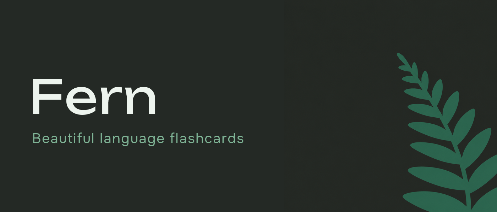

# 🌿 Fern — Language Flashcards

 

**Beautiful flashcards for learning languages** — Material You design, offline-first, FSRS spaced repetition. Learn words from videos, books and photos. No account, no cloud.

🇬🇧 🇷🇺 🇩🇪 🇫🇷 🇪🇸 🇮🇹 🇵🇹 · 7 languages

[**⬇ Download**](https://github.com/THET1ME-1/fern_releases/releases/latest) · [English](#english) · [Русский](#-fern-русский)

---

## English

### Stack
- **Flutter** (Material 3 Expressive, dynamic color / Material You, dark green theme)
- **Local-first** — everything on device: SQLite storage, JSON backup + merge, no account, no server
- **Offline engines** — [ML Kit](https://developers.google.com/ml-kit) translation & OCR on device; optional own translation servers (Ollama / LibreTranslate / DeepL / OpenAI-compatible)
- **FSRS** — own spaced-repetition scheduler (personalizable)

### Features
- **Smart study** — FSRS scheduling, adaptive **Learn** mode, daily goals, streaks with freezes, achievements, rich progress stats
- **Study modes** — Learn · Flashcards · Test · Match · Write · Dictation · Build-a-phrase · Audio · Context (cloze) · Hard words · Speed · Cram
- **Learn from videos** — paste a YouTube link → subtitles become word cards with translation, real-voice audio and karaoke reading
- **Learn from books** — EPUB / FB2 / TXT / SRT reader with tap-to-translate, chapters, bookmarks, reading themes, read-aloud, and a smart vocabulary analysis (how much of a text you already know)
- **Learn from photos (OCR)** — snap a page and turn words into cards
- **Fast word capture** — from the clipboard, from the system **Share** sheet, from photos
- **Grammar tables** — verb conjugation & noun forms right on the card (es / fr / de / it / pt / ru)
- **Pronunciation (TTS)**, part-of-speech tags, ready-made starter decks, deck import (Anki `.apkg` / CSV / TSV), vocabulary export
- **Custom study languages** — create, edit and pin your own; source language of videos/books is auto-detected
- **Themes** — light / dark / system / time-based, dynamic color, AMOLED
- **7 interface languages** 🇬🇧 🇷🇺 🇩🇪 🇫🇷 🇪🇸 🇮🇹 🇵🇹 (auto-detected from the phone)

### Install (Android)
Distributed **via GitHub Releases** (not on Google Play).

**Recommended — [Obtainium](https://github.com/ImranR98/Obtainium)** (auto-updates):
1. Install Obtainium.
2. **Add App** → paste `https://github.com/THET1ME-1/fern_releases` → Add.
3. Pick the APK for your CPU (`arm64-v8a` — almost all modern phones).

One-tap: `obtainium://add/https://github.com/THET1ME-1/fern_releases`

Or download the APK from the [releases page](https://github.com/THET1ME-1/fern_releases/releases/latest). The app also **updates itself** from within.

Signing fingerprint (SHA-256) to verify the APK:
`51:6E:FD:44:E8:AF:67:2B:A7:A9:B1:01:09:0D:B5:46:98:F5:BB:42:E1:09:C1:B0:0A:D4:AA:A5:2A:2C:E3:A1`

> ⚠️ **Upgrading from 1.14.0 or older?** Release builds are now signed with a permanent key
> (they used to be signed with a debug key). Android will refuse to install 1.15.0 over the old
> version. **Open Settings → Backup and save your data first**, then uninstall the old app,
> install 1.15.0 and restore. This is a one-time step — updates after that work as usual.

### Privacy
No account, no analytics, no cloud. Your decks, words and stats stay on your device (with optional local JSON backup). Online translation is only used if you enable it. Android's cloud backup is disabled, so nothing leaks to Google Drive either. Full policy: [docs/privacy-policy.md](docs/privacy-policy.md).

---

## 🌿 Fern (Русский)

**Fern** — красивые флеш-карточки для изучения языков в стиле **Material You**: тёмно-зелёная тема, офлайн-первично, умное интервальное повторение (FSRS). Учи слова из видео, книг и фото. Без аккаунта и облака.

### Стек
- **Flutter** (Material 3 Expressive, dynamic color / Material You)
- **Локально-первично** — всё на устройстве: хранилище SQLite, JSON-бэкап + слияние, без аккаунта и сервера
- **Офлайн-движки** — перевод и OCR через [ML Kit](https://developers.google.com/ml-kit) на устройстве; по желанию — свои серверы перевода (Ollama / LibreTranslate / DeepL / OpenAI-совместимые)
- **FSRS** — свой планировщик интервального повторения (персонализируемый)

### Особенности
- **Умное обучение** — FSRS-планировщик, адаптивный режим **«Учить»**, дневные цели, серии со щитами-заморозками, достижения, богатая статистика прогресса
- **Режимы** — Учить · Карточки · Тест · Подбор · Письмо · Диктант · Собери фразу · Аудио · Контекст · Трудные · Скорость · Перед экзаменом
- **Из видео** — вставь ссылку на YouTube → субтитры превращаются в карточки слов с переводом, живой озвучкой и караоке-чтением
- **Из книг** — читалка EPUB / FB2 / TXT / SRT с тапом-переводом, главами, закладками, темами чтения, чтением вслух и умным анализом словаря (сколько текста ты уже знаешь)
- **Из фото (OCR)** — сфотографируй страницу и добавь слова в колоду
- **Быстрый захват слов** — из буфера обмена, через системное **«Поделиться»**, с фото
- **Грамматика на карточке** — спряжение глаголов и формы существительных (es / fr / de / it / pt / ru)
- **Озвучка (TTS)**, теги частей речи, готовые стартовые колоды, импорт колод (Anki `.apkg` / CSV / TSV), экспорт словаря
- **Свои изучаемые языки** — создавай, редактируй и закрепляй свои; язык источника видео/книг определяется автоматически
- **Темы** — светлая / тёмная / системная / по времени, dynamic color, AMOLED
- **7 языков интерфейса** 🇷🇺 🇬🇧 🇩🇪 🇫🇷 🇪🇸 🇮🇹 🇵🇹 (определяются по телефону)

### Установка (Android)
Распространяется **через GitHub Releases** (не в Google Play).

**Рекомендуется — [Obtainium](https://github.com/ImranR98/Obtainium)** (авто-обновления):
1. Установи Obtainium.
2. **Add App** → вставь `https://github.com/THET1ME-1/fern_releases` → Add.
3. Выбери APK под свой процессор (`arm64-v8a` — почти все телефоны).

One-tap: `obtainium://add/https://github.com/THET1ME-1/fern_releases`

Или скачай APK со [страницы релизов](https://github.com/THET1ME-1/fern_releases/releases/latest). Приложение также **обновляется само** изнутри.

Отпечаток подписи (SHA-256) для проверки APK:
`51:6E:FD:44:E8:AF:67:2B:A7:A9:B1:01:09:0D:B5:46:98:F5:BB:42:E1:09:C1:B0:0A:D4:AA:A5:2A:2C:E3:A1`

> ⚠️ **Обновляешься с 1.14.0 или старее?** Релизы теперь подписаны постоянным ключом
> (раньше — отладочным), и Android откажется ставить 1.15.0 поверх старой версии.
> **Сначала зайди в Настройки → Резервная копия и сохрани данные**, потом удали старое
> приложение, поставь 1.15.0 и восстанови копию. Это разово — дальше обновления идут как обычно.

### Приватность
Без аккаунта, аналитики и облака. Колоды, слова и статистика остаются на устройстве (с опциональным локальным JSON-бэкапом). Онлайн-перевод — только если ты сам его включишь. Системный бэкап Android отключён — данные не уезжают и в Google Drive. Полная политика: [docs/privacy-policy.md](docs/privacy-policy.md).

---

🌿 Fern · Flutter · Material 3 Expressive · offline-first

